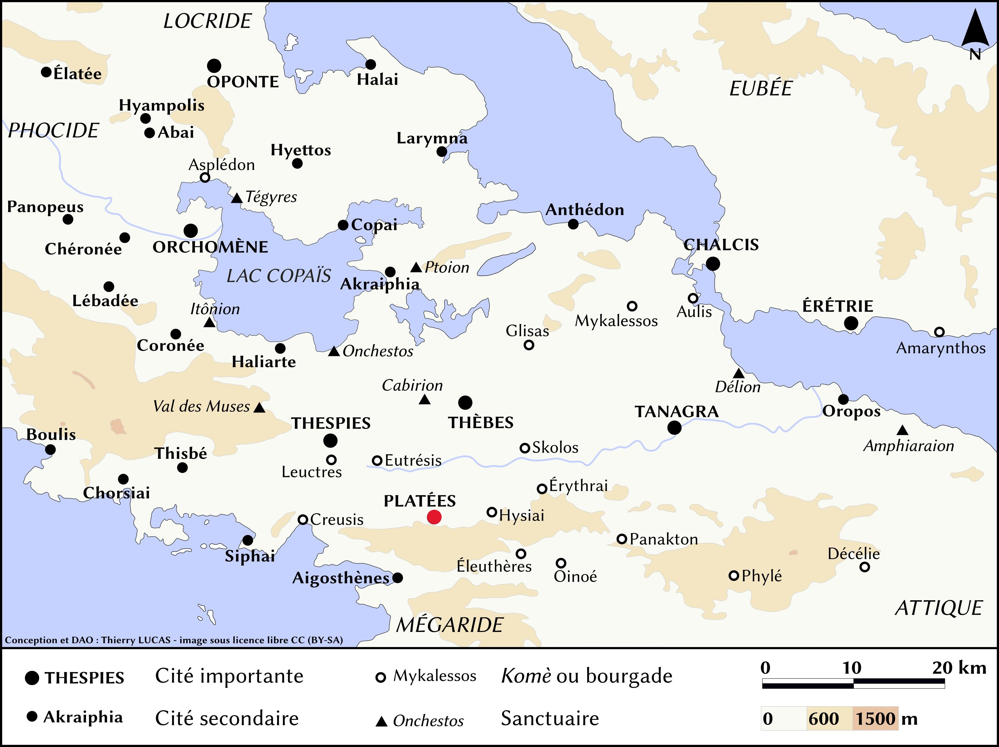
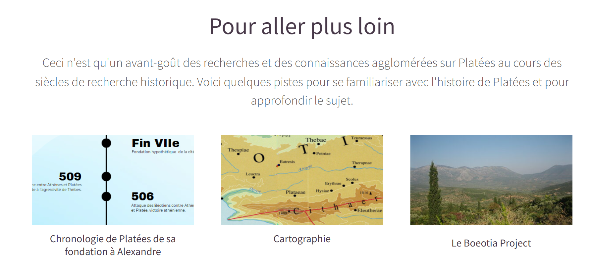
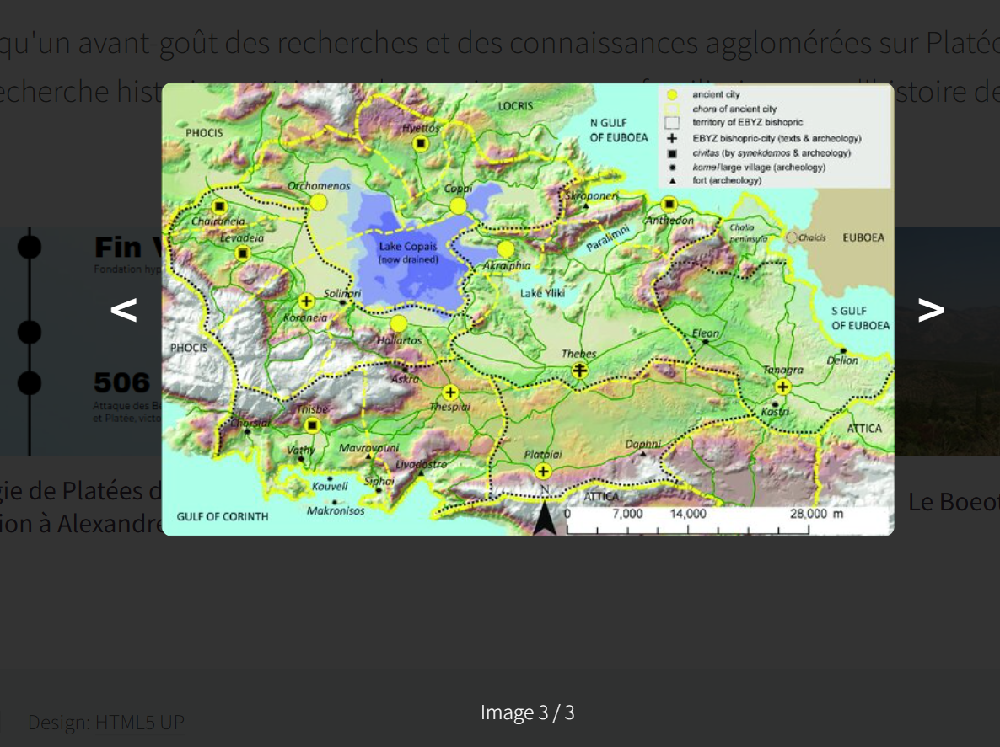
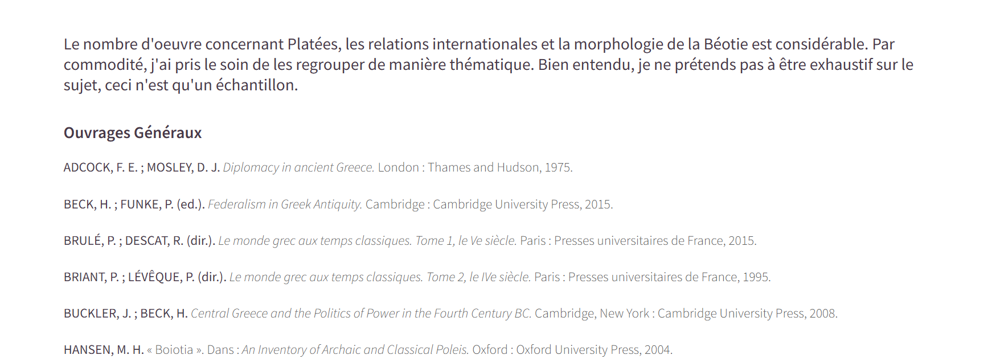
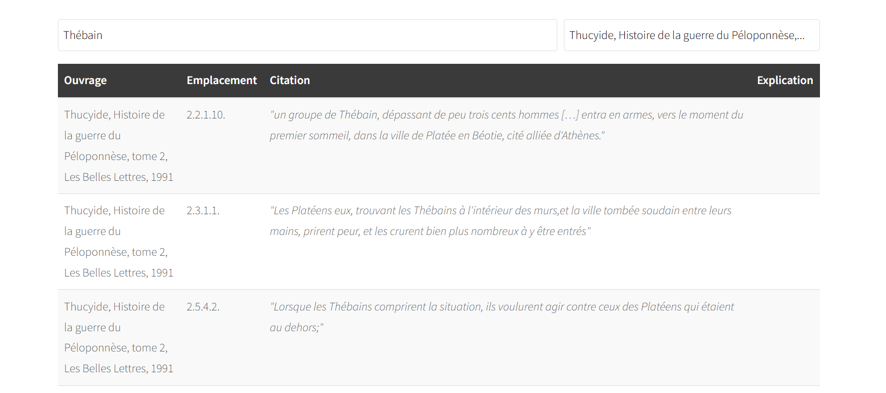

# Site Web : Platées dans le Monde Grec : Ve/ IVe siècle

Raphaël Chaillot

## La page principale

Lorsque j'ai commencé ce site web j'avais pour objectif non seulement de créer quelque chose de complet et ergonomique, mais aussi d'utile pour mon utilisation personnel. J'ai donc investi un temps non-négligeable dans ce projet, notamment dans la chronologie, les schémas et le tableau. J'ai choisi le template nommé Hélios sur html5.up.

j'ai choisi pour la page de garde de mettre une image de temple grec afin d'attirer le regard et donner un effet de profondeur sur le titre, au centre de la page, mais légèrement surélevé afin de favoriser la lisibilité. J'ai tenté plusieurs images et plusieurs couleurs car la lisibilité posait problème à cause de l'image. Cela m'a mené à légèrement flouté l'image et à mettre le titre en gras.
La barre supérieure possède 3 redirection. celle du centre mène sur la page centrale (la page actuelle) la redirection "bibliographie" mène à mon travail de recherche bibliographique sur mon sujet. Enfin l'onglet "Sources" mène à un tableau qui présente les sources que j'ai pu étudier.


```css
''' #header {
		position: relative;
		background-image: url("../../images/Header2.png");
		background-size: cover;
		background-position: center center;
		background-attachment: fixed;
		color: #FFD700;
		text-align: center;
		font-weight: bold;
		padding: 7.5em 0 2em 0;
		cursor: default;
```
Les caractéristiques de la page de garde ont été modifié dans le CSS, j'ai choisi la couleur #FFD700 similaire à de l'or vieilli car le mariage or-blanc est élégant. J'ai surtout modifié la couleur, l'image et le fait que les caractères soient en gras.

juste après une courte présentation, j'ai choisi de rapidement introduire mon sujet par la géographie.



Cette carte monumental qui inscrit Platées dans l'espace prend tout l'espace possible et vise à montrer à quel point ses rapports exterieurs sont conditionnés par son environnement direct. Pour cela j'ai recherché la résolution idéal afin d'éviter qu'elle ne se distorde dans le site web.

```html
'''
```

Après cela je me suis attelé à présenter plus en détail Platées et sa place dans Thucydide, auteur principal de mon corpus. J'ai pris garde à laisser des espaces entres les textes et les schémas pour davantage de lisibilité.

Pour illustrer mes propos, j'ai utilisé le site Voyant Tools pour faire des nuages de mots. Je les ais inclus dans mon site web grâce au lien que fournis Voyants Tools, cela permet de garder l'interactivité des schémas, contrairement à une simple capture d'écran. 

```html
'''<iframe style='width: 800px; height: 600px;' src='https://voyant-tools.org/tool/Cirrus/?stopList=keywords-fe0372b7b78c4a45048004ad3792eb55&whiteList=&visible=25&corpus=6b6906bb8c82ab5b8ab04496fb47ca5e'></iframe>
```

Néanmoins l'inconvénient est que ces diagrammes peuvent mettre un certain temps pour s'afficher, de plus interagir avec eux, en mettant par exemple la souris sur un mot pour voir le nombre d'itérations créer un clignotement de la fenêtre qui apparaît.

le "*main*" se termine par une explication finale de l'objectif de mon mémoire. dans celui-ci j'ai introduit un lien vers la page "sources" de mon site web par commodité et pour éviter à l'utilisateur de remonter en haut de la page.

```html
<p>L'objectif de mon mémoire est donc d'étudier les relations exterieur de Platées. Ceci est possible non seulemnent grâce à la richesse de récit de Thucydide mais aussi à de nombreuses autres sources littéraires (plus de détail <a href="Sources2.html"> ici</a>) mais aussi archéologique, grace aux importantes fouilles faite par l'école autrichienne. Mon but est non seulement d'oberserver les rapports interétatiques, mais aussi les rapports interpersonnels, ces deux notions se confandant souvent dans le monde Grec. Bien que je n'écarte pas la possibilitée d'aggrandir mon étude à la période hellénistique, mes recherches sont pour l'instant réduite à l'époque classique.</p>
```

Après le "*main*" commence la section "redirections additionnelles" ici j'ai rajouté des boites modales.

 

Au vu du peu de temps que j'ai pu utiliser pour apprendre javascript, j'ai dû m'aider de l'intelligence artificielle générative pour m'assister lorsque j'ai rencontré des problèmes. Je préfère vous le signaler, car même si l'IA générative est un outil vital pour tout codeur de demain je comprends que son utilisation peut vous poser problème. Néanmoins j'ai tout fait pour que ses interventions me soit autant utiles qu'instructives.

```html
		<style>
			.modal {
				display: none;
				position: fixed;
				z-index: 1000;
				left: 0;
				top: 0;
				width: 100%;
				height: 100%;
				background-color: rgba(0,0,0,0.8);
				align-items: center;
				justify-content: center;
			}
			
			.modal-content {
				max-width: 80%;
				max-height: 80%;
			}
			
			.modal-navigation {
        display: flex;
        align-items: center;
        justify-content: center;
        width: 100%;

			}
    
    		.nav-arrow {
        color: white;
        font-size: 3rem;
        font-weight: bold;
        cursor: pointer;
        padding: 0 20px;
        user-select: none;
  		  }
    
    		.nav-arrow:hover {
        color: #ddd;
    }
    
   			 .modal-counter {
        color: white;
        position: absolute;
        bottom: 20px;
        text-align: center;
        width: 100%;
    }
    
   			 .modal-close {
        position: absolute;
        top: 20px;
        right: 30px;
        color: white;
        font-size: 40px;
        font-weight: bold;
        cursor: pointer;
    }
			
		</style>
```
Tout d'abord j'ai défini le style, la forme et l'utilisation de la boite modal. Cette partie aurait normalement sa place dans le CSS, mais j'ai préféré la marquer au début de mon code HTML, car le site étant fait sur des qui me sont étrangère, j'ai considéré que le mettre dans mon HTML me permettait d'avoir plus de contrôle et d'éviter des problèmes chronophages. Bien que le template à de grands avantages, créer aussi à aussi les siens, bien que j'aurais aimé le faire de A à Z, le temps me manquait.

afin d'éviter de surcharger mon site web vers d'innombrable redirections vers d'autres pages web, j'ai privilégié des boites modales pour afficher ma chronologie et des cartes diverses. le code ci-dessus permet -entre autres- de définir les moyens d'ouverture et de fermeture de la boite modale, la taille de la boite modale sur la page, il inclut un arrière plans sombre et met en place des flèches pour faire défiler les images. Au début j'ai rencontré des problèmes car les images dépassaient de la boite modale et étaient illisible, c'est pourquoi j'ai décidé de réduire la taille maximale de la boite modale à 80% de la taille de la page.

le script de la première boite modale est plutôt simple et consiste à ouvrir la boite modale et à la fermer Selon son style définit plus haut.

une image différente de celle affiché apparaît lorsque l'utilisateur clique dessus. La boite modale disparaît lorsque l'utilisateur clique en dehors de celle-ci.
```java
'''<script> 
			function openModal() {
				var modal = document.getElementById("imageModal");
				var largeImage = document.getElementById("largeImage");
				
				
				largeImage.src = "images/ChronoGrande.png";
				modal.style.display = "flex";
			}
			
			function closeModal() {
				document.getElementById("imageModal").style.display = "none";
			}
		</script>
```
Pour la deuxième boite modale, il était nécessaire de pouvoir faire défiler les images.
J'ai donc créé une liste des images avec leur url. l' "index" permet de faire défiler les images grâce à une variable. 
```java
'''	const mapImages = [
				"images/Carte topo béotie Roesch.jpg",  
				"images/Carte ancienne XVIIIe.webp",   
				"images/Béotie antiquité tardive.jpg",
			];
			
			let currentImageIndex = 0;
```
Après avoir ouvert la boite modale, le script met en place un ordre pour chaque image (j'ai choisi de les trier de la plus à la moins pertinente). La fonction "updateModaleImage" permet de mettre à jours l'affichage.

 ```java
 '''function openMapModal(index) {
				const modal = document.getElementById("mapModal");
				const largeImage = document.getElementById("largeMapImage");
				const counter = document.getElementById("imageCounter");
				
				currentImageIndex = index;
				updateModalImage();
				modal.style.display = "flex";
			}
```
La fonction changeImage permet de faire défiler les images grâce à l'index et la fonction step. le % permet de rendre le défilement infini.

```java
'''function changeImage(step) {
				currentImageIndex = (currentImageIndex + step + mapImages.length) % mapImages.length;
				updateModalImage();
			}
```
Enfin la fonction counter.textContent permet de créer un compteur grace à l'index (dont la valeur de base est de O).

```java
'''counter.textContent = `Image ${currentImageIndex + 1} / ${mapImages.length}`;
			}
```
Ainsi, grâce à la boite modale j'ai pu mettre un grand nombre d'image dans mon site web sans le surcharger.



La dernière image nommé Boeotia Project est un simple redirection vers un site web scientifique centré sur l'étude de la Béotie.

Par ailleurs afin d'améliorer l'élégance de mon site web, j'ai ajouter un "favicon" présent sur toute les pages de mon site web. L'icône se veut similaire à une forme de monnaie, c'est pourquoi j'ai inscrit les initiales de la cité de Platées : ΠΛΑ.


```html
<link rel="icon" type="image/png" href="images/favicon.png">
```

## La page "Bilbiographie"

Cette page est la plus simple des 3, elle consiste à répertorier toute la bibliographie que j'ai rassemblé jusqu'à présent.



Cette partie n'a pas nécessité de codage particulier, si ce n'est pour mettre les auteurs en gras et les oeuvres en italique.

## La page "Sources"

Cette page est la plus complexe de mon projet, et j'ai eu beaucoup de difficulté à la mettre en place. Malheureusement, ma volonté de faire un tableau de mes sources interactif était en dehors de mes moyens, je me suis là encore appuyé sur l'IA pour m'aider à coder, mais de manière plus importante. Le code dépasse en grande partie ma compréhension.  Mais je voulais obtenir un outil qui me soit utile pour mon mémoire, et c'est chose faite. Je comprendrais néanmoins que cette partie ne soit pas pris en compte dans l'évaluation.
pour cette partie du site web, il est nécessaire d'autoriser Chrome à lire les fichiers locaux.

Pour réaliser ce tableau, j'ai utilisé la fonction Papa Parse qui permet de lire les fichiers CSV. En effet j'ai un tableau Excel de toute mes sources pour mon mémoire, je l'ai transformé en fichier CSV et converti en language UTF-8 pour l'utiliser correctement.

```java
'''<script src="https://cdnjs.cloudflare.com/ajax/libs/PapaParse/5.3.2/papaparse.min.js"></script>
```
Ce script permet de charger la bibliothèque PapaParse.

Au vue de la taille du code, je resterais relativement elliptique sur certaines parties pour me concentrer sur le principal.

Tout d'abord, les lignes 80 à 125 définissent la forme du tableau : le conteneur (l.79 à 83), le tableau en lui-même (l. 85 à 91), l'en-tête du tableau (l.93 à 101) puis des colonnes (l.103 à 116) et enfin le corps du tableau (l.118 à 119).

Puis viens l'utilissation de la fonction PapaParse

```java
'''			Papa.parse('Tableau.CSV', {
				download: true,
				header: true,
				encoding: "UTF-8",
				skipEmptyLines: true,
				complete: function(results) {
````

```java
'''if (results.data && results.data.length > 0) {

	    results.data.forEach((row, index) => {
		if (!row['Ouvrage'] && !row['Emplacement'] && !row['Citation']) {
			return; 
		}
````

Cette partie quant à elle permet de lire le fichier CSV en ignorant les vides inutiles.

Tout en bas du tableau, un message indique le nombre de source trouvé lors de la recherche grâce à cette fonction : 

````java
'''	const infoDiv = document.createElement('div');
				infoDiv.className = 'sources-info';
				infoDiv.textContent = `${results.data.length} sources littéraires répertoriées.`;
				infoDiv.style.marginTop = '15px';
				infoDiv.style.fontStyle = 'italic';
				infoDiv.style.textAlign = 'right';
				section.appendChild(infoDiv);
````

La fonction permet aussi de définir le style et l'emplacement du message.

Si le script rencontre une erreur, un message s'affichera : 

````java
'''				error: function(error) {
					tbody.innerHTML = '';
					const errorRow = document.createElement('tr');
					const errorCell = document.createElement('td');
					errorCell.colSpan = columns.length;
					errorCell.textContent = 'Erreur lors du chargement des données.';
					errorCell.style.padding = '20px';
					errorCell.style.textAlign = 'center';
					errorCell.style.color = 'red';
					errorRow.appendChild(errorCell);
					tbody.appendChild(errorRow);
````

Enfin, la grande partie du code restant est surtout dédié aux fonctions de filtrage (et à la création de leurs conteneurs), grâce à la fonction :
````java
'''function addFilteringCapabilities(table, data, columns, tbody) {
````

Ces fonctions de filtrages se base sur les colonnes du fichier CSV, il est possible de faire des recherches par mot-clé ou par oeuvre.



Si la colonne "explication" est vide, c'est parce que je n'ai pas trouvé nécessaire d'en insérer. Ce n'est pas une erreur du code.

la fonction select permet de créer un menu déroulant pour choisir les oeuvres
````java
'''const workSelect = document.createElement('select');
			workSelect.style.padding = '8px';
			workSelect.style.borderRadius = '4px';
			workSelect.style.border = '1px solid #ddd';
````

ce menu déroulant est obtenu grace à :
````java
'''const works = [...new Set(data.map(item => item['Ouvrage']).filter(Boolean))];
			works.sort();
````

Enfin après la création des conteneurs et des menus déroulants (dont je n'ai montré qu'un extrait), le coeur de la fonction de filtrage peut s'appliquer :
````java
'''	function filterTable() {
				const searchText = searchInput.value.toLowerCase();
				const selectedWork = workSelect.value;
				
				tbody.innerHTML = '';
				
				const filteredData = data.filter(row => {
````

Après les fonctions établissant le filtrage, il reste de la ligne 242 à la ligne 310 les fonction de vérification et d'affichage des données, et enfin la fonction de mise à jours du compteur.

